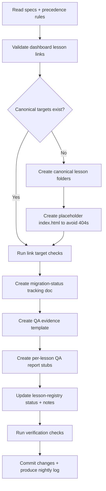

# Nightly Work Log — 2026-02-27

This log records completed work performed against repository standards, execution spec, runbook, and roadmap guidance.

## Scope Completed

1. Structure and governance docs were already added in previous commit and retained.
2. Canonical lesson path links were validated and made non-breaking.
3. Canonical lesson folders received working placeholder `index.html` files to prevent dashboard dead links.
4. Migration tracking + QA scaffolding were created for morning review.
5. Lesson registry statuses were updated to reflect actual current state.

## Files Added / Updated Tonight

### Added

- `lesson-time-management/index.html`
- `lesson-employee-accountability/index.html`
- `docs/migration-status.md`
- `docs/qa-evidence-template.md`
- `docs/qa-reports/lesson-interview-skills.md`
- `docs/qa-reports/lesson-time-management.md`
- `docs/qa-reports/lesson-employee-accountability.md`

### Updated

- `lesson-registry.json`

## Standards/Specs Followed

- `SPOKES-Agent-Execution-Spec.md`
- `SPOKES-Agent-Runbook.md`
- `SPOKES Builder/build-process.md`
- `SPOKES-Master-Action-Plan.md`
- `SPOKES-Project-Plan.md`

## Constraints and Blockers

- Legacy source lesson content for Time Management and Employee Accountability is not present locally; prior paths existed as gitlink/submodule-style entries with no materialized files.
- Placeholder pages were used intentionally so dashboard navigation remains functional while source recovery is pending.

## Workflow Diagram (Build + Execution)

## Morning Ready Review Checklist

- [ ] Open `Dashboard.html` and click all three lesson cards.
- [ ] Review `docs/migration-status.md` for blocker details.
- [ ] Review `docs/qa-reports/*` stubs for QA workflow.
- [ ] Confirm `lesson-registry.json` statuses align with desired sprint priority.

## Recommended First Action Tomorrow

Recover source files for:

- Time Management lesson
- Employee Accountability lesson

Then replace placeholder `index.html` files with real lesson builds and run full Gate 1-5 QA.
