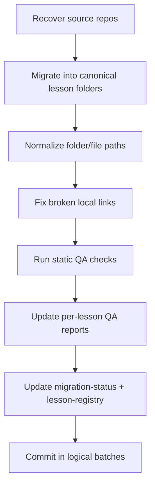

# Work Completed — 2026-02-28

## Objective
Complete the previously blocked migration work that required source lesson content.

## Completed Today

1. Migrated Employee Accountability source content into canonical path:
   - `lesson-employee-accountability/`
2. Migrated Time Management source content into canonical path:
   - `lesson-time-management/`
3. Normalized folder naming in Time Management:
   - `Teacher Resource/` → `Teacher-Resources/`
4. Fixed broken local PDF links in Time Management:
   - `GET_YOUR_PRIORITIES_STRAIGHT_FOR_THE_DAY_1.pdf` now points to `Handouts/...`
5. Ran static QA pass across all three active lessons:
   - local link integrity check
   - off-palette color detection in style contexts
6. Updated QA reports and migration/registry tracking docs.

## QA Artifacts Updated

- `docs/qa-reports/lesson-interview-skills.md`
- `docs/qa-reports/lesson-time-management.md`
- `docs/qa-reports/lesson-employee-accountability.md`
- `docs/qa-reports/static-audit-2026-02-28.md`
- `docs/migration-status.md`
- `lesson-registry.json`

## Current State

- Source content blockers are cleared.
- All three active lessons are now in **QA** status.
- Preliminary finding: **Brand Gate (Gate 4) is currently failing** in all three lessons due to off-palette colors.

## Next Work Queue

1. Palette remediation in all lesson CSS/theme blocks.
2. Full manual Gate 1/3/5 validation (device matrix + keyboard + interaction checks).
3. Final gate signoff and status promotion to `complete` in `lesson-registry.json`.

## Workflow Diagram

